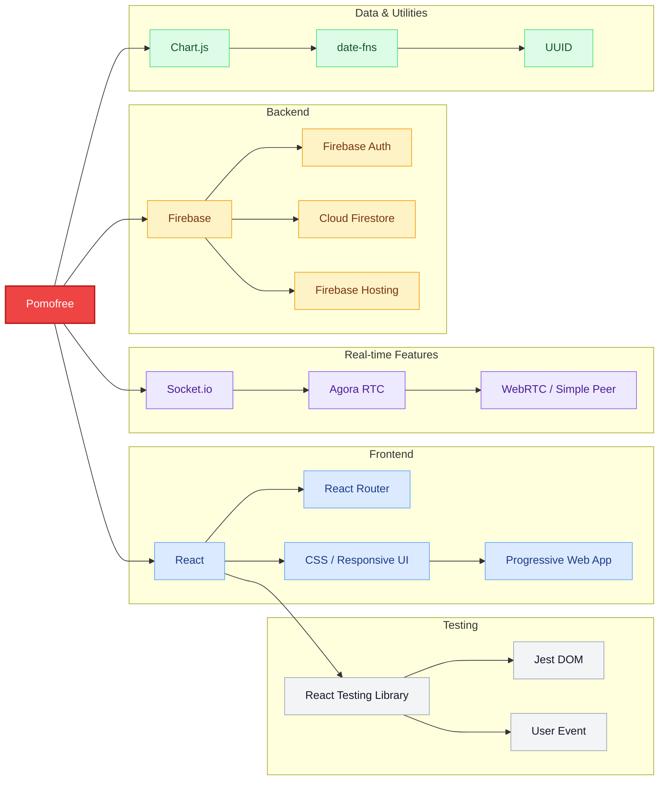

# Pomofree

Pomofree is a Pomodoro timer built with React. It combines a customizable focus timer with tasks, study rooms, music, progress tracking, and productivity reports.

The app works on desktop and mobile, and can also be installed as a Progressive Web App.

## Tech Stack



## Features

### Pomodoro timer

* Customizable focus, short break, and long break durations
* Automatic switching between timer modes
* Timer persistence while the tab is in the background
* Circular progress indicator
* Protection against accidentally refreshing an active session
* Sound and visual notifications

### Tasks and projects

* Create multiple projects
* Add and manage tasks inside each project
* Track completed Pomodoros per task
* View task and project completion statistics

### Study rooms

Pomofree includes shared focus rooms for people who want to work or study together.

* Create or join private rooms
* Keep timers synchronized between participants
* Receive live room updates
* Open the room in a separate window
* Optional video and audio communication through Agora

### Music player

The built-in player includes several focus-friendly categories:

* Lo-fi
* Jazz
* Classical
* Ambient
* Nature sounds

You can also play music using a custom YouTube URL. The player can be moved around the screen, minimized, and controlled without leaving the timer.

### Themes

Pomofree includes more than 12 themes, ranging from simple color schemes to styles such as Synthwave, Dark Academia, and Gothic Core.

Theme preferences are saved between sessions and can be changed without reloading the page.

### Statistics and goals

* Weekly focus statistics
* Daily, weekly, and monthly goals
* Productivity trends
* Task completion data
* Charts and progress indicators
* Achievement tracking

### Languages

The interface currently supports:

* English
* Turkish

Language changes are applied immediately, including interface text, notifications, dates, and time formatting.

### Authentication

Users can sign in with:

* Email and password
* Google
* Twitter / X

Authentication and user data are handled through Firebase.

## Getting started

### Requirements

Before running the project, make sure you have:

* Node.js 14 or newer
* npm or yarn
* A Firebase project

Some collaborative features also require Agora and Socket.io configuration.

### Installation

Clone the repository:

```bash
git clone https://github.com/yourusername/pomofree.git
cd pomofree
```

Install the dependencies:

```bash
npm install
```

Start the development server:

```bash
npm start
```

The app will be available at:

```text
http://localhost:3000
```

## Firebase setup

Create a Firebase project and enable the authentication methods you plan to use.

You will need to:

1. Enable Email/Password authentication
2. Enable Google authentication
3. Enable Twitter authentication, when needed
4. Create a Firestore database
5. Add your Firebase credentials to the project

Create a file at `src/firebase.js`:

```javascript
import { initializeApp } from "firebase/app";
import { getAuth } from "firebase/auth";
import { getFirestore } from "firebase/firestore";

const firebaseConfig = {
  apiKey: "your-api-key",
  authDomain: "your-project.firebaseapp.com",
  projectId: "your-project-id",
  storageBucket: "your-project.appspot.com",
  messagingSenderId: "your-sender-id",
  appId: "your-app-id",
};

const app = initializeApp(firebaseConfig);

export const auth = getAuth(app);
export const db = getFirestore(app);
```

Do not commit private credentials or environment-specific configuration to the repository.

## Available scripts

### `npm start`

Runs the app in development mode.

### `npm test`

Starts the test runner.

### `npm run build`

Creates a production build.

### `npm run eject`

Ejects the project from Create React App.

This operation cannot be reversed.

## Adding a theme

Themes are defined in `src/themes.js`.

```javascript
export const themes = {
  yourTheme: {
    name: "Your Theme Name",
    colors: {
      "--bg-color-pomodoro": "#your-color",
      "--bg-color-short": "#your-color",
      "--bg-color-long": "#your-color",
    },
  },
};
```

Add any additional CSS variables required by the interface, then include the theme in the theme selector.

## Adding a language

Translations are stored in `src/translations/index.js`.

```javascript
export const translations = {
  yourLanguage: {
    "timer.pomodoro": "Your translation",
  },
};
```

Make sure the new language contains translations for every interface key used by the app.

## Progressive Web App

Pomofree can be installed as a PWA on supported desktop and mobile browsers.

Once installed, it can be opened in its own window and used more like a native application.

## Tech stack

### Frontend

* React 19
* React DOM
* React Router
* CSS
* CSS Grid and Flexbox
* Create React App

### Backend and authentication

* Firebase
* Firebase Authentication
* Cloud Firestore
* Firebase Hosting

### Real-time communication

* Socket.io
* Agora RTC SDK
* Agora React UIKit
* Simple Peer
* WebRTC

### Charts and utilities

* Chart.js
* React Chart.js 2
* date-fns
* UUID
* Web Vitals

### Testing

* React Testing Library
* Jest DOM
* User Event

### External services

* Google OAuth
* Twitter / X OAuth
* YouTube API
* Agora
* Google AdSense

## Contributing

Contributions are welcome.

1. Fork the repository
2. Create a branch for your changes

```bash
git checkout -b feature/your-feature
```

3. Commit your changes

```bash
git commit -m "Add your feature"
```

4. Push the branch

```bash
git push origin feature/your-feature
```

5. Open a pull request

Try to keep pull requests focused on a single feature or fix, and include a clear explanation of what changed.

## License

This project is licensed under the MIT License. See the [LICENSE](LICENSE) file for details.

## Support

For questions or bug reports, contact:

```text
mert@lumie.zone```

You can also open an issue in the repository.

---

Built by [Lumi] (https://lumie.zone).
